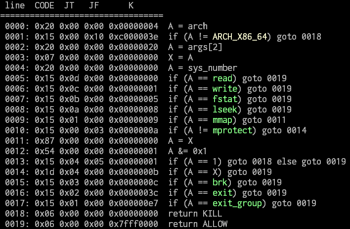

# 完美無瑕\~Impeccable Artifact\~

```
Arch:     amd64-64-little
RELRO:    Full RELRO
Stack:    Canary found
NX:       NX enabled
PIE:      PIE enabled
```

## Analysis

This challenge is a memo system, we can write to and read from stack. The target index isn't checked, thus we get handy arbitrarily read/write to use.

```c
while ( 1 )
{
  menu();
  idx = 0;
  _isoc99_scanf("%d", &choice);
  if ( choice != 1 && choice != 2 )
    break;
  puts("Idx?");
  _isoc99_scanf("%d", &idx);
  if ( choice == 1 )
  {
    printf("Here it is: %lld\n", memo[idx]); // arbitrarily read
  }
  else
  {
    puts("Give me your number:");
    _isoc99_scanf("%lld", &memo[idx]); // arbitrarily write
  }
}
```

We can't simply just leak libc base address and do ROP to get a shell, however, since it enables seccomp to blocks some system call.  
Thanks for the powerful [seccomp-tools](https://github.com/david942j/seccomp-tools) developed by **@david942j**, we can trace the seccomp filter clearly:



Apparently, `execve` and `execveat` get blocked, we need to find a way to leak the flag directly.

## Exploit

My plan is gaining executable permission on `.bss` and writing shellcode to `open -> read -> write` the flag. For the system call I will use, I have to satisfy their constraints:

* `mprotect`: `args[2] & 0x1 != 1`  
hence I set permission of partial `.bss` to `-wx`, this way `args[2]` will be 6
* `open`: `sys_number == args[2]`  
under x86_64, syscall number of `open` is 2, thus I set the third argument to 2
* `read`: allow directly
* `write`: allow directory

With this constraints in mind, I construct ROP chain to read shellcode, get executable permission and finally return to shellcode to print the flag out. I guess the path of flag to be `/home/artifact/flag` and it actually works :D

flag: `hitcon{why_libseccomp_cheated_me_Q_Q}`
